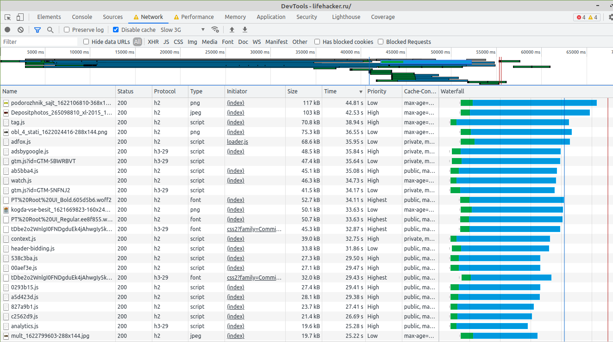
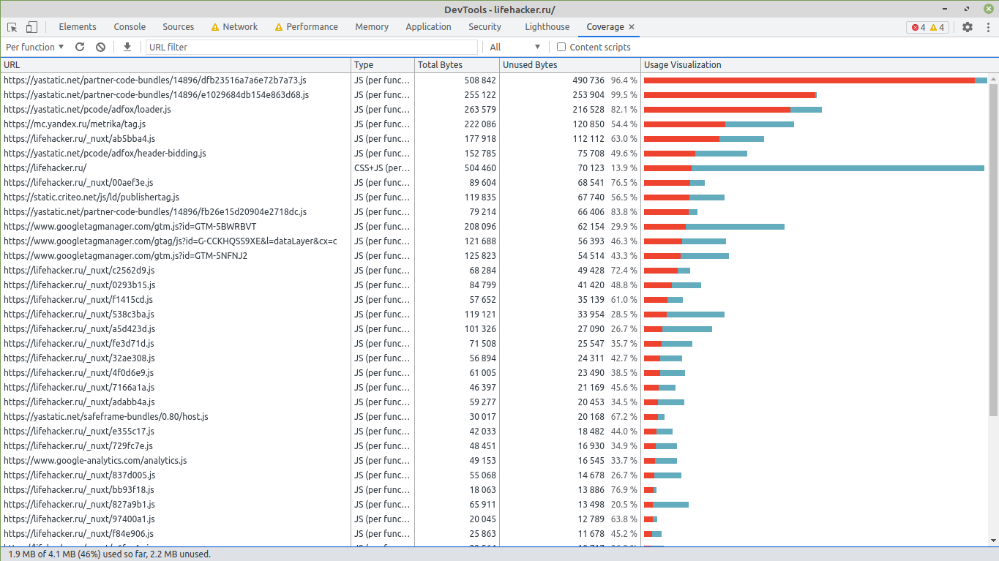
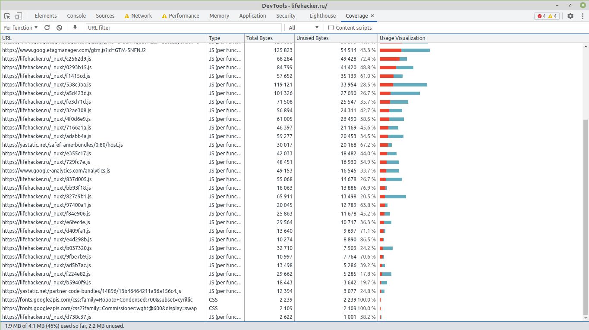

# Анализ сайта Лайфхакер с использованием Chrome DevTools

Адрес сайта: https://lifehacker.ru

Результаты получены в браузере Google Chrome (версия 91.0.4472.77 (Официальная сборка), (64 бит)) в режиме инкогнито с отключенными расширениями

### Без троттлинга

#### Вкладка Network

1. HAR архив с профилем загрузки ресурсов при открытии страницы в `profiles/lifehacker.ru.har`

2. Обнаруженные неоптимальные места:

    - Дублирование ресурсов:
    
    Два полностью идентичных шрифта:
    
    
    
    - Лишний размер ресурса
    
    В целом ресурсы оптимизированы по размеру, есть картинка, влияющая на FMP и которую можно было бы дополнительно минифицировать
    
    
    
    - Медленно загружающиеся ресурсы
    
    Некоторые чанки js-файлов загружаются чересчур долго для 20 килобайтных файлов
    
    
    
    - Ресурсы, блокирующие загрузку
    
    По сути блокирующий ресурс - это начальный index.html - он содержит в себе все стили и большУю часть скриптов, что может негативно сказаться при невысокой скорости интернета. 
    В то же время обилие небольших JS-файлов, которые практически не используются, также негативно влияет на загрузку страницы.
    Кэширование настроено корректно, но из-за того, что не кэшируется index.html стили и скрипты загружаются постоянно

#### Вкладка Performance

1. Профиль загрузки страницы в `profiles/Profile.json`

2. Время от начала навигации (4 мс)
    
    до First Paint - 267 мс
    
    до First Meaningful Paint - 723 мс
    
    до DOMContentLoaded - 3218 мс
    
    до Load - 3346 мс
    
3. Время, затраченное на разные этапы обработки документа за 3346 мс от навигации до события Load

    Loading - 61 мс
    
    Scripting - 897 мс
    
    Rendering - 155 мс
    
    Painting - 40 мс

#### Вкладка Coverage

1. Скриншот вкладки после загрузки страницы

    
    

2. Объём неиспользованного CSS

    Всего 2 ресурса CSS, 1 ресурс CSS+JS (CSS ~100 Кб)
    
    Суммарно: 2 + 2 + 100 = 104 Кб
   
    Неиспользованный: 2 + 2 + 100 * 0.14 = 18 Кб

3. Объём неиспользованного JS

    Всего 54 ресурса JS, 1 ресурс CSS+JS (JS ~400 Кб)
    
    Суммарно: ~4600 Кб
   
    Неиспользованный: ~2350 Кб

### С троттлингом 

- Network - Slow 3G;
- CPU - 4x slowdown

#### Вкладка Network

1. HAR архив с профилем загрузки ресурсов при открытии страницы в `profiles/lifehacker.ru_slow.har`

2. Обнаруженные неоптимальные места:

    - Дублирование ресурсов:
    
    Аналогично варианту без троттлинга - только два идентичных шрифта:
    
    
    
    - Лишний размер ресурса
    
    Также аналогично варианту без троттлинга не оптимизированы по размеру некоторые картинки
    
    - Медленно загружающиеся ресурсы
    
    Все файлы, кроме index.html загружаются очень медленно. Шрифты несмотря на приоритет Highest,аналогичный index.html, скачиваются так же долго, как и JS-файлы, ещё дольше скачиваются большие изображения. 
    
    
    
    - Ресурсы, блокирующие загрузку
    
    Блокирующим ресурсом для пользователя является index.html. После его загрузки, которая происходит достаточно быстро (с учётом замедления), сайт становится интерактивным и отображается корректно в плане стилизации.
    Тем не менее, дожидаться загрузки картинок приходится уже даже после DOMContentLoaded
    
#### Вкладка Performance

1. Профиль загрузки страницы в `profiles/Profile_slow.json`

2. Время от начала навигации (3 мс)
    
    до First Paint - 5895 мс
    
    до First Meaningful Paint - 43065 мс
    
    до DOMContentLoaded - 42236 мс
    
    до Load - 78341 мс
    
3. Время, затраченное на разные этапы обработки документа за 78341 мс от навигации до события Load

    Loading - 337 мс
    
    Scripting - 11574 мс
    
    Rendering - 3736 мс
    
    Painting - 3603 мс

#### Вкладка Coverage

1. Скриншот вкладки после загрузки страницы

    
    

2. Объём неиспользованного CSS

    Всего 2 ресурса CSS, 1 ресурс CSS+JS (CSS ~100 Кб)
    
    Суммарно: 2 + 2 + 100 = 104 Кб
   
    Неиспользованный: 2 + 2 + 100 * 0.14 = 18 Кб

3. Объём неиспользованного JS

    Всего 42 ресурса JS, 1 ресурс CSS+JS (JS ~400 Кб)
    
    Суммарно: ~4000 Кб
   
    Неиспользованный: ~2150 Кб
